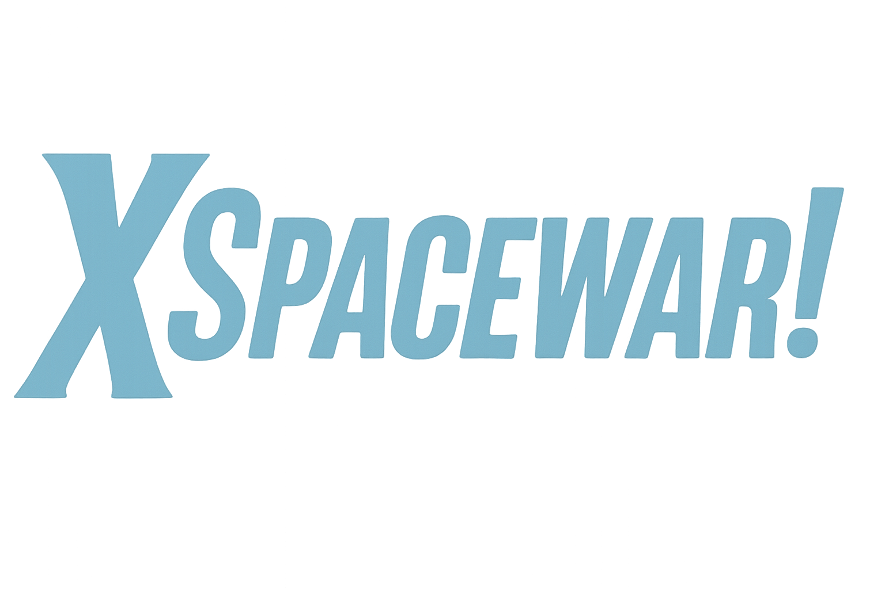
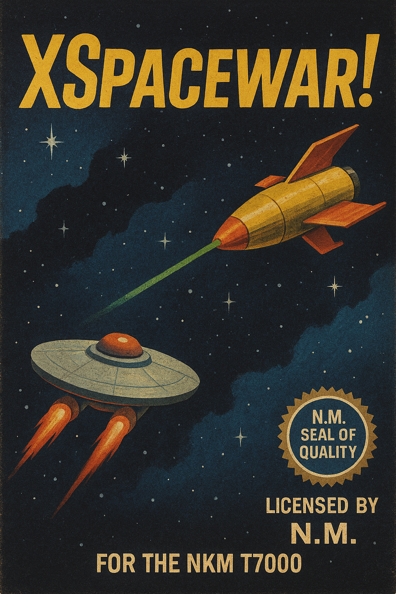

# XSpacewar!™ 🚀

## 🕹️ Game Overview
**XSpacewar!** is a modern tribute to the legendary **Spacewar!**, one of the very first video games ever created. Originally developed in 1962 by Steve Russell and fellow MIT pioneers, Spacewar! featured two spaceships battling in orbit around a central star, introducing groundbreaking concepts like gravity simulation and competitive multiplayer.

**XSpacewar!** captures that same pioneering spirit, reimagined with a retro-futuristic aesthetic inspired by 1960s sci-fi. Up to four spacecraft can engage in intense interstellar duels, with 2 to 4 players battling simultaneously. Use laser weapons, execute evasive maneuvers, and navigate a gravitational field that challenges every tactic. Designed for the **NKM T7000™** system.

## 🎨 Box Art

## 🎮 Gameplay Preview

Players can enable or disable visual effects that emulate old CRT monitors, including:

- **Burn-in**: simulates the subtle image persistence caused by static elements.
- **Flickering**: recreates the intermittent screen flicker typical of cathode-ray displays.

These effects are designed to evoke a nostalgic atmosphere and can be toggled in the game settings.

👉 [Play XSpacewar! Online]()
  

## 📁 Assets & Licensing

This project uses [Raylib](https://www.raylib.com/) — a simple and easy-to-use library to learn game programming.  
Raylib is licensed under the zlib/libpng license, which allows free use in both open-source and commercial projects.

All other assets (images, sounds, fonts) are either original creations or sourced from libraries that allow free use in open-source and commercial projects.

### 🖋️ Fonts
- [VT323](https://fonts.google.com/specimen/VT323?query=vt323) — Google Fonts  
- [Google Sans Code](https://fonts.google.com/specimen/Google+Sans+Code?query=sans+code) — Google Fonts  

### 🔊 Audio
- **Explosion_02.wav** by LittleRobotSoundFactory  
  [Link](https://freesound.org/s/270306/) — License: Attribution 4.0  

- **Retro, Laser Shot 03.wav** by LilMati  
  [Link](https://freesound.org/s/414885/) — License: Creative Commons 0